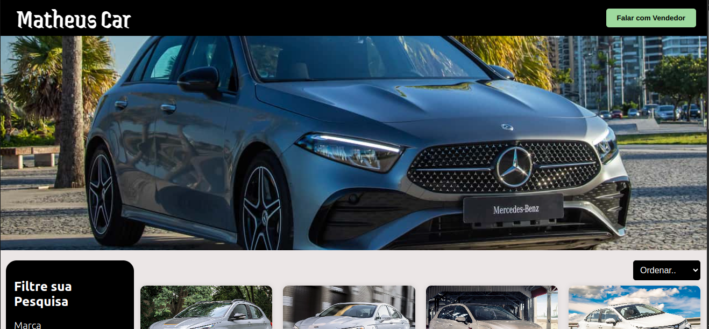
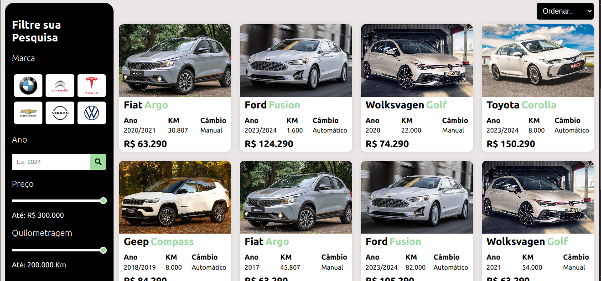
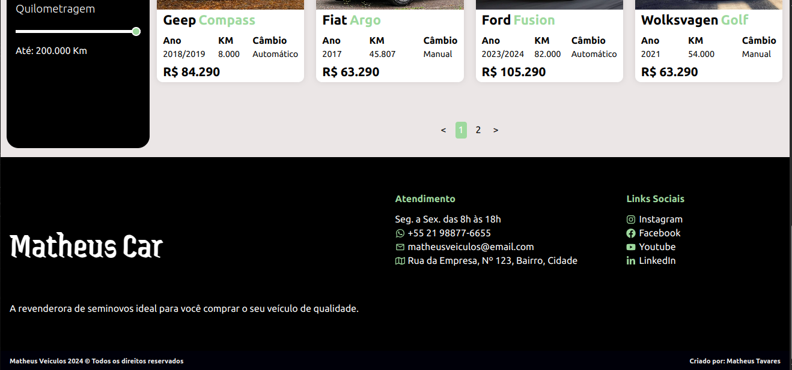
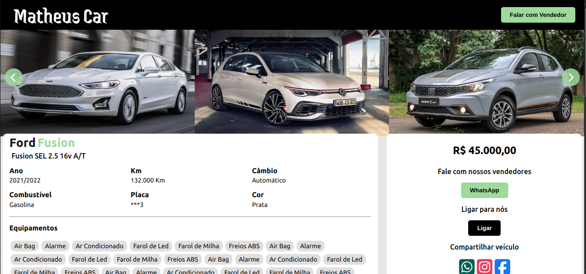
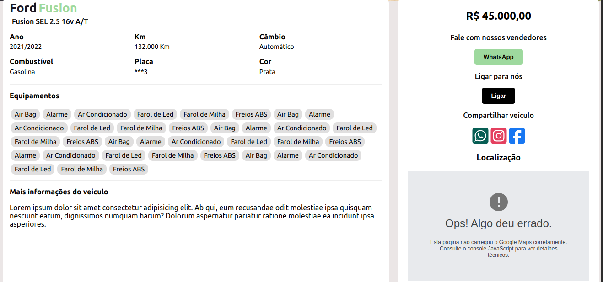

<h1 align="center">Car Store</h1>

<h3>Main used technologies</h3>

<ul>
<li>React</li>
<li>Styled Components</li>
<li>Google maps API</li>
<li>Axios</li>
<li>React icons</li>
</ul>

<h3>Screen Images</h3>

<h4>Desktop Images</h4>

 - Home page

 - Car details page

<h4>Mobile Images</h4>

 - Home page

 - Car details page

<h3>To run the project locally follow these steps</h3>
<ol>
<li>Clone the project:</li>

git clone https://github.com/soymattheus/Car-Store.git

<li>Enter the cloned project folder</li>

<li>Install required packges:</li>

yarn

<li>Run the project locally:</li>

yarn start

</ol>

I hope you like this little project.

If you have any difficulties, you can send me a message via <a href="https://www.linkedin.com/in/mattheusdev/" target="_blank">linkedIn</a>.

If you have ideas, contributions or would like to give any constructive criticism, feel free to message me via <a href="https://www.linkedin.com/in/mattheusdev/" target="_blank">linkedIn</a>. Any contribution will be welcome.
